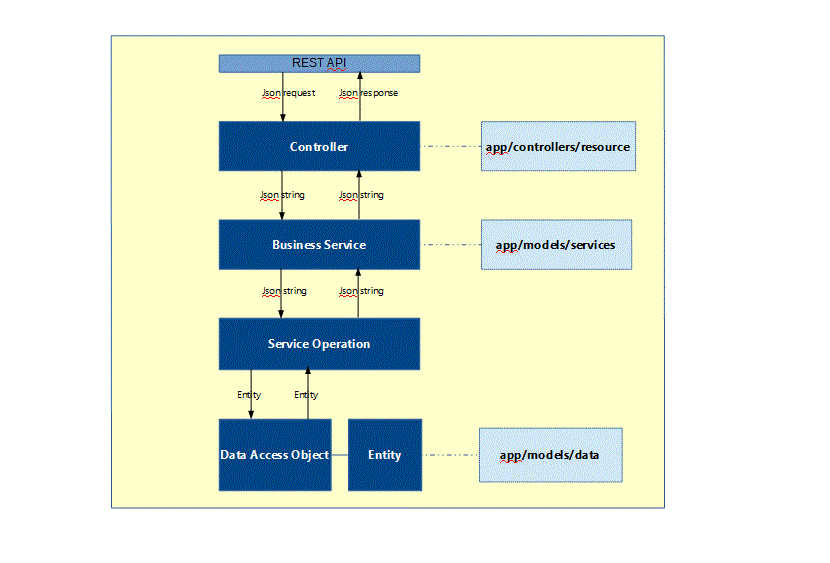
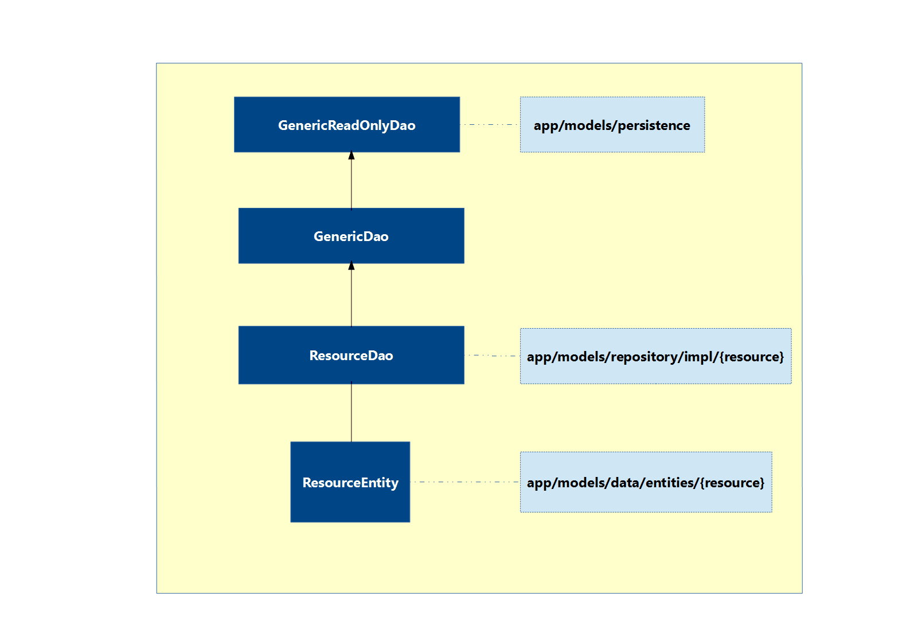
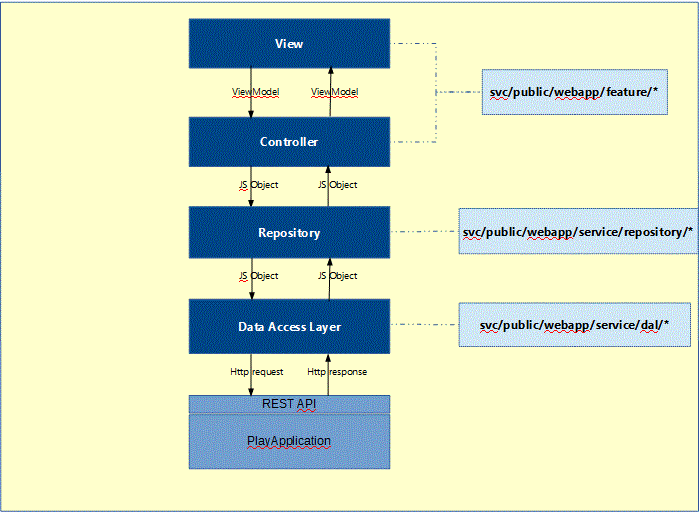

PAMM - SEED
-----------

PAMM-SEED is a template for building Web Applications using the PAMM stack:

-   [Play](https://www.playframework.com/) for server side web pages and services

-   [AngularJS](https://angularjs.org/) for client side rich user interfaces

-   [MariaDb](https://mariadb.org/) for relational data

-   [MongoDb](https://www.mongodb.org/community) for document based non-relational data

Pre-requisites
-----

Prior to running the PAMM seed the Play framework should be installed on your machine. See the [Play website](https://www.playframework.com/download) for installation instructions.

Index
-----

**[1. Architecture](#Architecture)**

**[2. Play Component](#PlayComponent)**

- [Http Layer](#HttpLayer)
- [Business Service Layer](#BusinessServiceLayer)
- [Repository Layer](#RepositoryLayer)
- [Persistence Layer](#PersistenceLayer)

**[3. Angular Component](#AngularComponent)**

- [View Layer](#ViewLayer)
- [Controller Layer](#ControllerLayer)
- [Repository Layer](#AngularRepoLayer)
- [Data Access Layer](#DAL)
- [Configuration](#Configuration)
- [Navigation](#Navigation)

**[4. Testing](#Testing)**

- [Application End to End Testing](#ApplicationEndToEndTesting)
- [Angular Client Unit Testing](#AngularClientUnitTesting)
- [Play Integration Testing](#PlayIntegrationTesting)
- [Play Unit Testing](#PlayUnitTesting)

**[5. Running The Application](#RunningTheApplication)**

1. Architecture
---------------

The following diagram shows the high level reference architecture for the application: 

2. Play Component
-----------------

The Play component of the PAMM seed consists of the following layers:

### 2.1 Http Layer ###

The Http layer exposes the applications RESTful API to clients, facilitated by the [Play framework routing mechanism](https://www.playframework.com/documentation/2.4.3/JavaRouting). Each resource endpoint exposes a RESTful API for a single application resource.

The Resource Endpoints responsibility is to accept requests for a resource and delegate the processing of that request to a Business Service Layer component. The Transactional boundary for the processing of a request is defined on the Action methods of the Resource Endpoint. All resource endpoint implementations should extend the [ResourceEndpoint](./svc/app/controllers/resource/play/ResourceEndpoint.java) superclass. See [ProjectEndpoint](./svc/app/controllers/resource/play/ProjectsEndpoint.java) for a basic implementation.

### 2.2 Business Service Layer ###

The Business Service layer services provide a [façade](https://en.wikipedia.org/wiki/Facade_pattern) style interface to a number of underlying service operations. Each service is an aggregation of service operations, with each service operation providing business logic to maintain application resources.

Each service operation should inherit from the ServiceOperation superclass, with any application "cross cutting" behaviour (e.g. application level authentication and authorization, audit, error handling) being managed by the ServiceOperation superclass. Comments have been included in this class as a placeholder for this logic to be included if required.

### 2.3 Repository Layer ###

The Repository is an abstraction layer, hiding details of any persistence mechanism from the applications business logic in the Business Service layer. This abstraction layer enables the persistence mechanism to be changed without having an effect on the Business layer. It also facilitates testing of the Business layer in isolation from the Persistence layer.

This seed provides a basic example of a Repository implementation, the [ProjectJpaRepository](./svc/app/models/repository/jpa/ProjectJpaRepository.java), which persists to a Relational H2 database, using the JPA interface with a Hibernate implementation. 

To change the persistence mechanism, a new implementation of the [Repository`<Project`>](./svc/app/models/services/project/ProjectRepository.java) needs to be created and injected into the Business layers service operations. To change the implementation of the Repository being injected into the Business Layer operations, amend the bindings defined in [RepositoriesModule](./svc/app/util/inject/play/RepositoriesModule.java).

A Repository should be created for the "aggregate root" (i.e. the root object in the object graph) of an application feature or component. Defining the granularity of repositories is something that has to be carried out on a project by project basis. 

E.g. If we have a feature called Manage Person Details, where a Person has an associated address, employment, income etc, then the aggregate root would be the object from which all these details can be accessed, which in this example would most likely be Person. A Repository`<Person>` interface would then be defined and used by the Business Layer to access Person and its associated data. A Repository`<Person>` implementation would be created for the required persistence mechanism. 

### 2.4 Persistence Layer ###

The Persistence layer provides the application persistence mechanism and its persistence model. This seed uses JPA with a Hibernate implementation to persist data to an in-memory H2 database. 

#### 2.4.1 Configuration ####

This requires the following configuration (already set up in the seed).

a) conf/application.conf - Defines configuration for the Datasource to access the H2 database. Specifies the jdbc url, the jndi name for the Datasource, the H2 database driver.

The default persistence unit for the application is also defined in the application.conf file by setting the jpa.default property. When play.db.jpa.JPA.em() is invoked with no arguments, it will return an Entity manager for this default persistence unit. 

b) conf/META-INF/persistence.xml - Defines the persistence unit for the application, specifying Hibernate as the persistence provider and referencing the H2 database datasource.

c) build.sbt - include the dependencies for javaJpa and hibernate.

#### 2.4.2 High Level Class Structure ####

*GenericReadOnlyDao*: Base class for all application Data access objects, providing methods to find, list and search for entities. An EntityManager instance is made available through the EntityManagerProvider factory class. This is obtained from the play.db.jpa.JPA.em() static method returning an entity manager instance for the currently running thread.

*GenericDao*: Provides generic methods to create, update and delete entities.

*EntityManagerProvider*: Factory class to encapsulate the play.db.jpa.JPA static method to return the EntityManager instance for the currently running thread.

Any entity specific queries should be placed in the Dao associated with that entity. E.g. If the ProjectEntity requires a database query not included in the Generic Dao classes, then a method for that database query should be added to the ProjectDao class.

3. Angular Component
--------------------

The Angular component of the PAMM seed has been developed in accordance with the Angular team endorsed [Style and Development guidlines.](https://github.com/johnpapa/angular-styleguide)

For tutorials and an overview of the Angular framework see the [Angular Developer Guide](https://docs.angularjs.org/guide) website.

The following is the high level structure of the Angular component of the PAMM seed.

### 3.1 View Layer ###

The folder structure of the angular application is organised by application feature as recommended in the [Application structure section](https://github.com/johnpapa/angular-styleguide#application-structure) of the Angular Style and Development Guide.

Each feature folder contains one or more HTML partial(s) defining how the feature will be presented to the user, a .less file containing the CSS for styling this feature, and one or more javascript files defining the controller(s) for the feature.

Each HTML partial has a reference to the Controller that will provide the view with its data (viewModel), with the controller being referenced from the view according to the best practices defined in the [Angular Style and Development Guide](https://github.com/johnpapa/angular-styleguide#controllers). 

### 3.2 Controller Layer ###

The responsibility of each Controller is to provide data to its associated view, and to interpret events from that view and delegate the processing of those events to the appropriate repository service.  

Each controller is wrapped in an [Immediately Invoked Function Expression](https://github.com/johnpapa/angular-styleguide#iife), so that the Angular components are defined outside of the Global scope. The Angular Style and Development Guide provides [guidelines](https://github.com/johnpapa/angular-styleguide#controllers) for the declaration of Controllers, and recommendations for structuring code in a Controller. These guidelines have been used in the development of the PAMM seed Controllers. 

### 3.3 Repository Layer ###

The Repository Layer is a cache for data gathered from the server side Play application. It is a stateful service mediating between the controller layer and the data access layer. 

The repository service is wrapped in an [Immediately Invoked Function Expression](https://github.com/johnpapa/angular-styleguide#iife), so that the repository service is defined outside of the Global scope. 

The [Angular decorator mechanism](https://docs.angularjs.org/api/ng/type/angular.Module) is used to add functionality to the core repository implementation for each of the application features. This is demonstrated in the [project.js](./svc/public/webapp/service/repository/project.js) file, where the core repository implementation defined in [repository.js](./svc/public/webapp/service/repository/repository.js) is decorated with functions to manage project specific data.

**Note**: This mechanism for adding functionality to the core repository implementation can lead to issues if multiple decorators both add the same named function to the repository. In this instance, the function in the decorator defined last in the index.html file would take precedence.

E.g. If we have projects.js and users.js which both decorate repository.js with the same function save(), then if users.js was listed in the index.html file after projects.js, the save() function defined in projects.js would never be invoked, effectively hidden by the implementation of save() in users.js.

### 3.4 Data Access Layer ###

The Data Access Layer (DAL) is a stateless service providing access to the RESTful API exposed by the Play application.

The DAL should only be accessed from the Repository layer, with the Controllers requesting their data from the Repository instead of accessing the DAL directly.

The DAL employs the promise mechanism to avoid blocking the serving thread while waiting for an HTTP response. This means that any calls to the DAL will also return a promise. All HTTP calls initiated from the DAL layer should be routed through the [service-caller.js](./svc/public/webapp/service/dal/dal.js) component.

Like the Repository layer, The [Angular decorator mechanism](https://docs.angularjs.org/api/ng/type/angular.Module) is used to add functionality to the core data access component implementation for each of the application features. This is demonstrated in the [project.js](./svc/public/webapp/service/dal/project.js) file, where the core data access component implementation defined in [dal.js](./svc/public/webapp/service/util/service-caller.js) is decorated with functions to manage project specific data.

**Note**: Again, like with the repository, this mechanism for adding functionality to the core data access component implementation can lead to issues if multiple decorators both add the same named function to the data access component. In this instance, the function in the decorator defined last in the index.html file would take precedence.

### 3.5 Configuration ###

There are 2 configuration points in the Angular component. The first is in [app.js](./svc/public/webapp/app.js) to define an interceptor to apply a standard authentication mechanism to each HTTP request triggered from the DAL layer.

The second configuration point is the [app-state-manager.js](./svc/public/webapp/app-state-manager.js) to define the applications navigation model based on application states.

The [Angular Style and Development Guide](https://github.com/johnpapa/angular-styleguide#startup-logic) provides guidelines on what functionality should be included in the application configuration phase

### 3.6 Navigation ###

The navigation mechanism chosen for the Angular component is provided by the [UI-Router](https://github.com/angular-ui/ui-router/wiki) library. The navigation is based on application state, with each state being associated with a view template, view properties and optionally a controller (for this implementation the controllers are defined in the view templates).

The states are hierarchical and the template for a child state will be "slotted" into the template associated with its parent state. The [app-state-manager.js](./svc/public/webapp/app-state-manager.js) file defines the following states:

		home
		
		home.dashboard
		
		home.project
		
		home.projectadd

The template associated with the home state will be slotted into the [index.html](./svc/public/webapp/index.html) page where the data-ui-view directive is specified, while the templates associated with the child states (dashboard, project and projectadd) will be slotted into the data-ui-view directive in the [home-index.html](./svc/public/webapp/feature/home/home-index.html) partial)

4. Testing
----------

### 4.1 Application End To End Testing ###

For the Application End To End Testing, we are using the Protractor end to end testing framework along with the Cucumber BDD tool. 

Protractor (and our end to end test scripts) run on a node.js server and communicate with a Selenium server through Selenium Webdriver API bindings. This link provides an overview of the [Protractor testing components](https://angular.github.io/protractor/#/infrastructure) and how they collaborate to run the end to end tests:

#### 4.1.1 Prerequisites ####

Modules required to run the Protractor end to end tests are specified in the [Protractor readMe file](svc/test/webapp/e2e_tests/README_protractor)

#### 4.1.2 Test Configuration ####

The following files have been configured to run the Protractor end to end tests for the seed:

**[Protractor conf.js file](svc/test/webapp/e2e_tests/conf.js)**

The following link provides a comprehensive list of properties that can be set for your [Protractor configuration](https://github.com/angular/protractor/blob/master/docs/referenceConf.js), and descriptions of how to use these properties.

**[package.json](./package.json)**

The following link provides a comprehensive list of properties that can be set for your [npm package.json configuration](https://docs.npmjs.com/files/package.json), and descriptions of how to use these properties.

#### 4.1.3 Test structure ####

Each feature being tested will have the following fileset located under the following base folder

		svc/test/webapp/e2e_tests/features/

- A Gherkin feature file defining the Feature to be tested and the test scenarios for the feature. See the [manage-project.feature](svc/test/webapp/e2e_tests/features/manage-project/manage-project.feature) for an example feature file.

- A cucumber script implementing the steps defined in the Gherkin feature file, to test the scenarios in the Gherkin feature file. See the [manage-project step definition](svc/test/webapp/e2e_tests/features/manage-project/stepDefinitions.js) for an example cucumber step definition script.
 

- Page Object script(s), encapsulating the user interface actions required by the cucumber scripts in order to implement the scenarios defined in the Gherkin feature file.  See the [manage-project page model](svc/test/webapp/e2e_tests/page-models/manage-project.page.js) for an example page model.

Scenarios that require data setup, should make use of the testsetup child project included in the seed. This is a Play application exposing a RESTful API for the execution of SQL scripts. To invoke a SQL script through the testsetup application, cucumber scripts should invoke the executeScript(scriptNumber) function of the following script. 

		svc/test/webapp/e2e_tests/util/setup-service-caller.js

See the call to setup.executeScript(1) in the  [manage-project step definition](svc/test/webapp/e2e_tests/features/manage-project/stepDefinitions.js) for an example.  

The SQL scripts to set up test data should be placed in the following directory of the testsetup child project

		testsetup/conf/sql-scripts/ 

and referenced in the [config.properties](./testsetup/conf/sql-scripts/config.properties) file.

#### 4.1.4 Test Execution ####

**Running from command line**

To run the Protractor tests open a command window at the PAMM seed root folder.

Enter the following command

	npm run e2e_cucumber_test

This will invoke the protractor-test "event" in the [package.json](./package.json) file, which runs the command "./node_modules/.bin/protractor svc/test/webapp/e2e_tests/conf.js"

This will output the Gherkin style scenario description for each scenario run, and display which tests have passed or failed. 

**Running as part of project build**

The [build.sbt](build.sbt) file has been configured to invoke the Protractor tests to execute  as part of the sbt endToEndTest task.

The [E2ETestTask.scala](project/E2ETestTask.scala) file contains the definition for this task. The task will start up a selenium server, start an H2 database, run the svc project, run the testsetup project and finally run the protractor tests.

To run the Protractor tests through the build task, open a command window at the PAMM seed root folder and run the following command

    activator svc/endToEndTest

This will invoke all processes on which the Protractor tests are dependent (Selenium Server, H2 database server, svc Play application and testsetup Play application). Once these processes have successfully started, the Protractor tests will be run. After completion of the Protractor tests, all dependent processes are automatically stopped by this build task.

The output from the Test run is written to the following folder under the PAMM seed root folder

	test-e2e-results/CCYY-MM-DD-HH.mm.ss.SSS

where CCYY-MM-DD-HH.mm.ss.SSS is the timestamp for the test run. Each test run will result in a new folder being created to store its test output. The Protractor test results are stored in the file protractorResults.log in the above folder.

### 4.2 Angular Client Unit Testing ###

For the unit testing of the Angular client components, Jasmine test framework libraries are used to create the test functions, with these tests being run by the karma test runner framework.

#### 4.2.1 Prerequisites ####

Modules that are required to run the jasmine unit tests with the karma test runner framework are specified in the [Karma readMe file](svc/test/webapp/unit/README_karma).

#### 4.2.2 Test Configuration ####

The following files have been configured to invoke the karma test runner to execute the jasmine unit tests:

**[karma.conf.js:](svc/test/webapp/unit/karma.conf.js)**

The following link provides a comprehensive list of properties that can be set for your [Karma configuration](http://karma-runner.github.io/0.13/config/configuration-file.html), and descriptions of how to use these properties.

**[package.json](./package.json)**

The following link provides a comprehensive list of properties that can be set for your [npm package.json configuration](https://docs.npmjs.com/files/package.json), and descriptions of how to use these properties.

#### 4.2.3 Test structure ####

For unit testing of our Angular javascript components, the following convention has been followed.

For each javascript component that we unit test within the folder

		svc/public/webapp

a corresponding jasmine unit test component has been created in an identically named folder hierarchy within the folder

		svc/test/webapp/unit 

e.g. in order to test the component

		svc/public/webapp/feature/login/login-controller.js 

we would create the following jasmine test script 

		svc/test/webapp/unit/feature/login/login-controller.spec.js 

and html file

		svc/test/webapp/unit/feature/login/login-controller.test.html 

Each test has an html file defining the dependencies required to run the individual tests and a javascript file containing the jasmine unit test scripts to be executed.

See [login-controller.test.html](svc/test/webapp/unit/feature/login/login-controller.test.html) for an example of an html file defining the test dependencies, and [login-controller.spec.js](svc/test/webapp/unit/feature/login/login-controller.spec.js) for example jasmine test scripts.

#### 4.2.4 Test Execution ####

**Running from command line**

To run the jasmine tests with the karma test runner, open a command window at the PAMM seed root folder.

Enter the following command

     npm run jasmine-test

This will invoke the test "event" in the [package.json](./package.json) file, which runs the command "./node_modules/.bin/karma start svc/test/webapp/unit/karma.conf.js"

Any unsuccessful tests will be displayed on the command window, with details of the test that failed and the name of the jasmine file. 

**Running as part of project build**

The [build.sbt](build.sbt) file has been configured to invoke the karma test runner to execute the jasmine unit tests as part of the sbt test task.

The [ClientTestTask.scala](project/ClientTestTask.scala) file contains the definition for this client test task

To run the karma tests open a command window at the project root and enter the following command

    activator svc/test

This will invoke the Play unit tests as well as the Angular client unit tests.

### 4.3 Play Integration Testing ###

Play provides a variety of [Helper utilities](https://www.playframework.com/documentation/2.4.3/JavaFunctionalTest) that facilitate integration testing of Play application features. 

The PAMM seed uses these Play Helper utilities to test the endpoints exposed to the Angular client. The [ProjectsEndpointTest.java](svc/test/java/integration/controllers/resource/play/ProjectsEndpointTest.java) class provides an example of how to test an application endpoint. It's superclass [EndpointTest.java](svc/test/java/integration/controllers/EndpointTest.java) starts a "fake" Play application in which to execute the tests, with one [EndpointTestCase.java](svc/test/java/integration/controllers/EndpointTestCase.java) being invoked per test method in [ProjectsEndpointTest.java](svc/test/java/integration/controllers/resource/play/ProjectsEndpointTest.java).

The integration tests are placed in the following folder

	svc/test/java/integration/controllers/resource/play
 
The integration tests in the Play application are currently included in the "sbt test" task, so are run along with with the Play application unit tests.

### 4.4 Play Unit Testing ###
In order for unit tests in the Play application to be invoked as part of the "sbt test" task, simply follow the instructions as detailed on the [Play Framework Testing page](https://www.playframework.com/documentation/2.4.3/JavaTest). 

The unit tests are placed in the following folder

	svc/test/java/unit/

The [JSONHelperTest.java](svc/test/java/unit/util/json/play/JSONHelperTest.java) provides a simple example of a Junit test.

5. Running the Application
----------

Open a command window at the PAMM seed root folder and enter the following command

	activator svc/startPAMM

This will start the H2 database server on port 9092, and the Play application on port 9000.

Enter the following URL in a browser

    http://localhost:9000

The PAMM login page should be presented. The seed has no authentication configured for this initial draft version, so by entering any username and password, the PAMM dashboard should be displayed. The angular client is integrated with the Play backend and any actions on the Angular client will be routed to the Play backend.

To shutdown the database and Play application open a command window at the project root folder and enter the following command

	activator svc/stopPAMM

